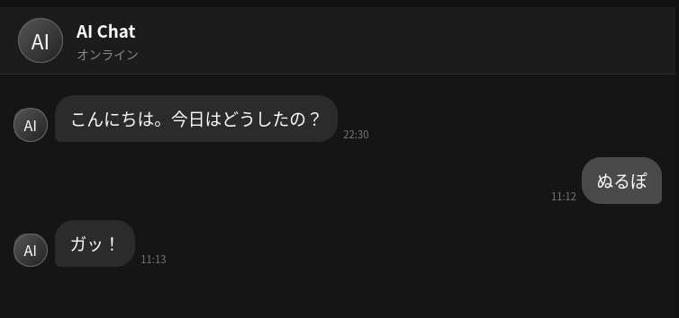

# aichat
AIと会話できるチャットアプリです。

## 使い方
### 必要なもの
- cURL
- Git
- Bun (最新推奨、開発者の環境はv1.3.14)

### インストール
1. ターミナルを開く
2. `git clone https://github.com/tarutarudev/aichat.git;cd aichat;bun i`を実行
3. 完了！

### 起動
1. Google GeminiのAPIキーを`.env`に入れる
   GEMINI_API_KEY="APIKEY" ←こんな感じの内容
3. `bun start`を実行し、`https://localhost:3000`へブラウザでアクセス

### サンプル

